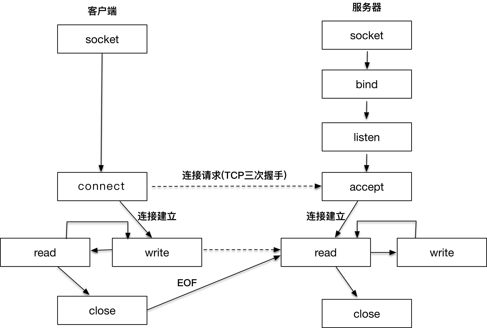

***

## socket 到底是什么？

这张图表达的其实是网络编程中，客户端和服务器工作的核心逻辑。

我们先从右侧的服务器端开始看，因为在客户端发起连接请求之前，服务器端必须初始化好。右侧的图显示的是服务器端初始化的过程，首先初始化 socket，之后服务器端需要执行 bind 函数，将自己的服务能力绑定在一个众所周知的地址和端口上，紧接着，服务器端执行 listen 操作，将原先的 socket 转化为服务端的 socket，服务端最后阻塞在 accept 上等待客户端请求的到来。

此时，服务器端已经准备就绪。客户端需要先初始化 socket，再执行 connect 向服务器端的地址和端口发起连接请求，这里的地址和端口必须是客户端预先知晓的。这个过程，就是著名的 TCP 三次握手（Three-way Handshake）。下一篇文章，我会详细讲到 TCP 三次握手的原理。

一旦三次握手完成，客户端和服务器端建立连接，就进入了数据传输过程。

具体来说，客户端进程向操作系统内核发起 write 字节流写操作，内核协议栈将字节流通过网络设备传输到服务器端，服务器端从内核得到信息，将字节流从内核读入到进程中，并开始业务逻辑的处理，完成之后，服务器端再将得到的结果以同样的方式写给客户端。可以看到，一旦连接建立，数据的传输就不再是单向的，而是双向的，这也是 TCP 的一个显著特性。

当客户端完成和服务器端的交互后，比如执行一次 Telnet 操作，或者一次 HTTP 请求，需要和服务器端断开连接时，就会执行 close 函数，操作系统内核此时会通过原先的连接链路向服务器端发送一个 FIN 包，服务器收到之后执行被动关闭，这时候整个链路处于半关闭状态，此后，服务器端也会执行 close 函数，整个链路才会真正关闭。半关闭的状态下，发起 close 请求的一方在没有收到对方 FIN 包之前都认为连接是正常的；而在全关闭的状态下，双方都感知连接已经关闭。

>以上所有的操作，都是通过 socket 来完成的。无论是客户端的 connect，还是服务端的 accept，或者 read/write 操作等，socket 是我们用来建立连接，传输数据的唯一途径。

***

### 更好地理解 socket：一个更直观的解释

你可以把整个 TCP 的网络交互和数据传输想象成打电话，顺着这个思路想象，socket 就好像是我们手里的电话机，connect 就好比拿着电话机拨号，而服务器端的 bind 就好比是去电信公司开户，将电话号码和我们家里的电话机绑定，这样别人就可以用这个号码找到你，listen 就好似人们在家里听到了响铃，accept 就好比是被叫的一方拿起电话开始应答。至此，三次握手就完成了，连接建立完毕。

接下来，拨打电话的人开始说话：“你好。”这时就进入了 write，接收电话的人听到的过程可以想象成 read（听到并读出数据），并且开始应答，双方就进入了 read/write 的数据传输过程。

最后，拨打电话的人完成了此次交流，挂上电话，对应的操作可以理解为 close，接听电话的人知道对方已挂机，也挂上电话，也是一次 close。

在整个电话交流过程中，电话是我们可以和外面通信的设备，对应到网络编程的世界里，socket 也是我们可以和外界进行网络通信的途径。

