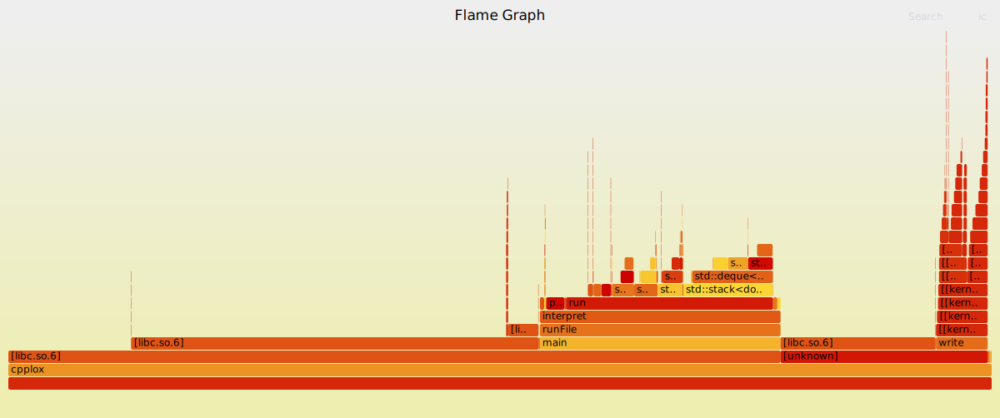

# Linux笔记

**文件权限控制**

```shell
chmod 755 /path/to/file
chown ${username} /path/to/file
```


**正常解压gbk编码格式的文件**

```shell
unzip -O gbk path/to/archive1.zip path/to/archive2.zip
```

**定时执行脚本**

`cronie` 使用 `cronie.service`

```
systemctl enable cronie.service
```

开始编辑cron表

```bash
crontab -e
```

具体内容

```bash
0 9 * * * /path/to/your/script.sh
```

这个例子中，`0`代表分钟，`9`代表小时，`* * *`代表日期、月份和星期几，表示每天都匹配。`/path/to/your/script.sh`是要执行的脚本的路径。

- 分钟（0-59）
- 小时（0-23）
- 日期（1-31）
- 月份（1-12）
- 星期几（0-7，其中0和7都表示星期日）

输出所有定时任务

```bash
crontab -l
```


***

shell中1&将STDERR和STDOUT的输出重定向到同一个管道

`chattr` 修改文件属性

使某文件/文件夹不可被修改/删除
```shell
chattr +i path/to/file_or_directory
```

`lsattr` 查看文件属性

**任务管理**

`jobs` 查看终端中的任务列表（在后台运行的任务）

`bg`和`fg`：将后台作业切换到前台或将前台作业切换到后台。

- `bg %job_number`: 将编号为`job_number`的作业切换到后台运行。
- `fg %job_number`: 将编号为`job_number`的作业切换到前台运行。

按下 `Ctrl + Z` 键组合可以将正在运行的任务（前台任务）暂停，并将其切换到后台。这个操作通常称为挂起（suspend）。


`disown` shell内建命令。是一个 shell 内建命令，用于将*后台作业*从当前 shell 的作业列表中移除。 这意味着，即使终端关闭，相关进程也不会收到挂起信号（SIGHUP），从而继续运行。

比如
```bash
dolphin . &
disown
```


`nohup`（no hang up）命令用于运行程序时忽略挂起信号（SIGHUP），即使终端关闭，程序也会继续运行。 它会将程序的标准输出和标准错误输出重定向到 `nohup.out` 文件，除非你指定了其他输出文件。

```bash
nohup dolphin . &
```

[Linux中的管道与连接符号 - 知乎](https://zhuanlan.zhihu.com/p/223681357)

**获得两个文件之间的相对路径**

```sh
realpath FILE(traget)  --relative-to=FILE(current)
```

[Linux获取两个路径之间的相对路径](https://www.cnblogs.com/jmliao/p/12400597.html)

ln：
  - 创建指向文件或目录的符号链接：
    ln -s /路径/到/文件或目录 路径/到/符号链接

  - 覆盖现有的符号链接以指向其他文件：
    ln -sf /路径/到/新文件 路径/到/符号链接

  - 创建文件的硬链接：
    ln /路径/到/文件 路径/到/硬链接


软链接类似于Windows的快捷方式

而对于硬链接类似于一种clone，原文件被修改也会同步到硬链接上，但删除不会。
硬链接不能链接目录，只能链接文件。


**scp 传输文件**

```shell
scp 本地文件路径 remote_username@remote_ip:remote_文件名 # 本地文件复制到远程

scp remote_username@remote_ip:remote_文件名 本地文件路径 # 远程文件复制到本地
```

使用方式类似于`cp`

`-r` 递归复制目录


**PATH环境变量**

```shell
vim ~/.bashrc
```

```shell
export PATH=$PATH:/usr/local/src/python3/bin
# 或
export PATH=/usr/local/src/python3/bin:$PATH
```


## 网络


### lsof


**查看端口占用情况**

```shell
lsof -i:[port]
```
### netstat

netstat命令用于显示网络连接和路由表信息。

-n：直接使用IP地址，而不通过域名服务器。
-l：显示监控中的服务器的Socket。
-t：显示TCP传输协议的连线状况。
-u：显示UDP传输协议的连线状况。
-p：显示正在使用Socket的程序识别码和程序名称。


显示所有活动的网络连接：
   ```
   netstat -a
   ```


## 好用的工具

`cloc` 统计代码行数

`tokei` 统计代码行数，但是速度更快

`ncdu` 查看文件(夹)占用空间

`tealdeer` [tealdeer(tldr的rust客户端，速度更快)](https://github.com/dbrgn/tealdeer)

`dwebp` 将`webp`图片转换为`png`格式

```shell
dwebp input.webp -o output.png
```

`notify-send` 使用当前桌面环境的消息系统发送消息

```shell
notify-send "Test" "This is a test"

notify-send "Test" --icon=google-chrome --app-name="Google Chrome"

notify-send -t 5000 "Test" "This is a test"

```

### 测试

`hyperfine` benchmark工具 

```shell
hyperfine --prepare zsh --warmup 10 --min-runs=1000 './path/to/program > /dev/null'
```

`valgrind` C++应用内存、并发问题检查

```shell
valgrind --leak-check=full --show-leak-kinds=all ./my_program # 检查内存泄露问题
valgrind --tool=helgrind ./my_program # 检查并发问题
```


`webbench` 网络压力测试

```shell
webbench -c [并发量] -t [时间-秒] [target]

# sample
webbench -c 500 -t 60 localhost:8080
```


`locust` 性能测试

[Locust - A modern load testing framework](https://locust.io/)


**火焰图 flamegraph**

安装
```
sudo yay -S flamegraph-git
```

使用

```shell
# 生成文件 perf.data
sudo perf record -F 99 -p {pid} -g -- sleep 60 # 使用 Linux perf_events（又名“perf”）捕获 60 秒的 99 赫兹堆栈样本，程序PID为{pid}

# 生成 out.perf
sudo perf script > out.perf

# 生成 out.folder
sudo stackcollapse-perf out.perf > out.folded

# 生成svg图片
sudo flamegraph.pl out.folded > {name}.svg
```


*快速bash脚本*

使用:
```shell
./script.sh {pid}
```

```bash
#! /usr/bin/env bash

# 使用 Linux perf_events（又名“perf”）捕获 30 秒的 99 赫兹堆栈样本，程序PID为{pid}
# sudo perf record -F 99 -p "$1" -g -- sleep 30 

# 分析程序 $1
sudo perf record "$1" -F 99 -g -- sleep 30

# 生成 out.perf
sudo perf script > out.perf

# 生成 out.folder
sudo stackcollapse-perf out.perf > out.folded

# 生成svg图片
sudo flamegraph out.folded > "$1".svg

sudo chmod +r "$1".svg
```

结果:


reference:
[GitHub - brendangregg/FlameGraph: Stack trace visualizer](https://github.com/brendangregg/FlameGraph)
[利用火焰图分析程序性能瓶颈 | 齐浩天的博客](https://blog.angelmsger.com/%E5%88%A9%E7%94%A8%E7%81%AB%E7%84%B0%E5%9B%BE%E5%88%86%E6%9E%90%E7%A8%8B%E5%BA%8F%E6%80%A7%E8%83%BD%E7%93%B6%E9%A2%88/)
## 桌面环境

kde查看哪些应用运行在x11或wayland下

```shell
qdbus org.kde.KWin /KWin org.kde.KWin.showDebugConsole
```


chrome electron wayland配置

chrome-flags.conf
```
--enable-features=UseOzonePlatform
--ozone-platform=wayland
--enable-wayland-ime 
```


20 之后
electron-flags.conf
```
--ozone-platform-hint=auto
--enable-wayland-ime 
```


## 应用程序

mpv播放器

启用硬件解码(自动选择解码方式)
`--hwdec=auto`


## anacron

`anacron` 是 Linux 系统中一个用于在不连续运行的系统上执行定期任务的工具。与 `cron` 不同，`cron` 只会在指定的时间点运行任务，`anacron` 则会在系统启动时检查是否错过了任务，并在系统开启时补上。

### `anacron` 与 `cron` 的区别

- `cron` 是基于时间的调度器，它依赖于系统的时间和日期，假如系统在某个预定的时间没有运行，任务会被错过。
- `anacron` 适用于那些不是持续运行的系统（比如笔记本、台式机等），如果系统没有在预定时间运行，`anacron` 会确保任务在下次开机后被执行。

### 1. 配置文件

`anacron` 的配置文件通常是 `/etc/anacrontab`。你可以在这里定义定期任务。文件的格式如下：

```bash
# period   delay   job-identifier   command
# period: 任务周期（天数）
# delay: 任务延迟（分钟），即任务开始执行前的等待时间
# job-identifier: 任务的唯一标识符
# command: 执行的命令
```

### 2. `/etc/anacrontab` 文件的结构

示例 `/etc/anacrontab` 文件：

```bash
# /etc/anacrontab: configuration file for anacron

# period   delay   job-identifier   command
1       5       cron.daily         run-parts /etc/cron.daily
7       10      cron.weekly        run-parts /etc/cron.weekly
30      15      cron.monthly       run-parts /etc/cron.monthly
```

- `1 5 cron.daily run-parts /etc/cron.daily`：每天运行 `/etc/cron.daily` 目录下的所有脚本，执行时间延迟 5 分钟。
- `7 10 cron.weekly run-parts /etc/cron.weekly`：每周运行 `/etc/cron.weekly` 目录下的所有脚本，执行时间延迟 10 分钟。
- `30 15 cron.monthly run-parts /etc/cron.monthly`：每月运行 `/etc/cron.monthly` 目录下的所有脚本，执行时间延迟 15 分钟。

### 3. 配置周期

- **1**：表示任务每 1 天执行一次。
- **7**：表示任务每 7 天执行一次。
- **30**：表示任务每 30 天执行一次。

### 4. 启动任务

当系统启动时，`anacron` 会检查任务是否已按预定时间执行。如果没有，它会根据 `anacrontab` 中的配置立即执行该任务。你不需要像 `cron` 一样确保任务在指定时间前运行，只需要保证系统启动时执行。

### 5. 手动执行任务

你可以通过命令手动执行 `anacron` 任务：

```bash
sudo anacron -s
```

`-s` 参数是指手动运行 `anacron`，这将执行所有错过的任务。注意，`anacron` 需要有系统时间与系统启动时间的对比，因此通常会自动在系统启动时执行。

### 6. 检查执行情况

`anacron` 会在 `/var/spool/anacron` 目录下记录每个任务的上次执行时间。你可以查看这个目录下的文件来确认任务是否成功执行。

### 总结

- `anacron` 适用于那些不连续运行的系统，通过启动时检查是否错过了任务并补上。
- 配置文件 `/etc/anacrontab` 中定义了任务的周期和执行命令。
- `anacron` 会自动在系统启动时运行，因此不需要像 `cron` 那样保证系统一直运行。